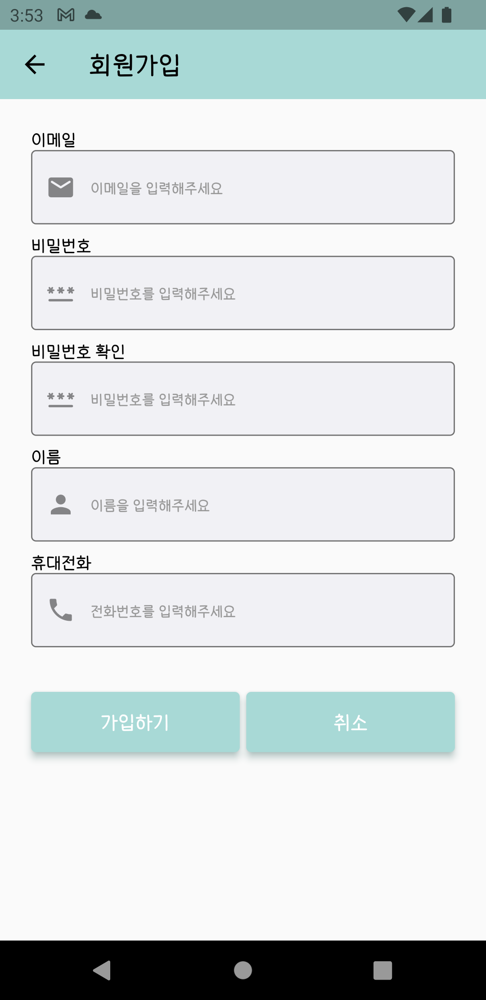

<!-- PROJECT LOGO -->
 

  <h3 align="center">지구를 생각하는 작은 마음 - 티끌 -</h3>
  

  <a target="_blank" href="https://github.com/GDSC-Hackaton-Team-CnB/BetaTest/raw/main/app-release.apk/app-release.apk">
    <h6 align="center">APK Download</h3>
  </a>

# 목차
1. [프로젝트 설명](#content1)
2. [팀 멤버](#content2)
3. [기술 스택 및 Framework, Library](#content3)
4. [UI](#content4)
5. [기대효과](#content5)
 

# 1. 프로젝트 설명 

### 프로젝트명 : 티끌

지구를 생각하는 작은 마음들이 만들어가는 변화.

환경오염으로 고통 받고 있는 지구를 위해 작은 실천으로 지구의 아픔을 해결하고자 프로젝트를 진행하게 되었습니다. 

### 기능

- 과거와 현재, 근 미래의 기온을 차트를 통해 비교해 볼 수 있습니다.
- 환경 관련 뉴스를 손쉽게 확인할 수 있습니다.
- 사소할지도 모르지만, 미션을 클리어하며 직접 환경 보호를 실천할 수 있습니다.
- 5개의 랜덤 퀴즈를 풀며 환경 지식을 쌓을 수 있습니다.
- 미션과 퀴즈로 얻은 점수를 다른 유저들과 비교할 수 있습니다.

# 2. 팀 멤버 

- [이준용](https://github.com/given-dragon) : Front-End
    - 로그인/회원가입 Page
    - 미션 Page
    - Flutter & Firebase 연동
- [정지윤](https://github.com/jiiiiiyoon) : Front-End
    - 메인 Page
    - 퀴즈 Page
- [유성주](https://github.com/sungju1572) : ML
    - 기온 예측 모델 생성
- [한태규](https://github.com/TaegyuHan) : Back-End, Design
    - APP 디자인
    - News 기사 Crawling
    - Firebase 모델링 및, 데이터 관리

# 3. 기술 스택 및 Framework, Library 

- **디자인**
    - [Adobe XD](https://www.adobe.com/products/xd.html)
    - [Zeplin](https://zeplin.io/)
- **ML**  **(** [Python](https://www.python.org/) : `3.8.12` **)**
    - [tensorflow](https://www.tensorflow.org/?hl=ko) & [keras](https://keras.io/) : `2.6.0`
    - [pandas](https://pandas.pydata.org/) : `1.2.4`
- **Back (** [Python](https://www.python.org/) : `3.10.1` **)**
    - [firebase-admin](https://firebase.google.com/docs/reference/admin/python?hl=ko) : `5.2.0`
    - [Requests](https://docs.python-requests.org/en/latest/) : `2.27.1`
    - [Beautiful Soup4](https://www.crummy.com/software/BeautifulSoup/bs4/doc/) : `4.10.0`
- **Front (** [Dart](https://dart.dev/) : `2.15.1`**)**
    - [Flutter](https://flutter.dev/?gclid=Cj0KCQiAuvOPBhDXARIsAKzLQ8EuCPnbnUymdGONSqwC2_UpSmFtwELET3WliGT5njgvghTP37yBe6MaAtvREALw_wcB&gclsrc=aw.ds) : `2.8.1`
        - [Firebase](https://firebase.google.com/)
            - [firebase_core](https://pub.dev/packages/firebase_core): `^1.12.0`
            - [cloud_firestore](https://pub.dev/packages/cloud_firestore): `^3.1.7`
            - [firebase_auth](https://pub.dev/packages/firebase_auth): `^3.3.6`
        - Social Auth
            - [google_sign_in](https://pub.dev/packages/google_sign_in): `^5.2.3`
            - [flutter_facebook_auth](https://pub.dev/packages/flutter_facebook_auth): `^4.0.1`
    

# 4. UI 
## GPS 동의

  

 

- GPS를 통해 현재 위치의 날씨 정보를 얻을 수 있습니다.

## 회원가입

  

  

 

- Google 및 Facebook을 연동하여 회원가입이 가능합니다.

## 메인

  

 

- 과거의 현재, 근 미래의 기온을 차트를 통해 비교해 볼 수 있습니다.
- 환경 관련 뉴스를 손쉽게 확인할 수 있습니다.
- 자신의 위치의 날씨 정보를 얻을 수 있습니다.

## 미션 및 랭킹

  

  

  

  

 

- 미션을 완료하며 직접 환경 보호를 실천할 수 있습니다.
- 다른 사용자와 점수를 비교하여 자신의 랭킹을 확인할 수 있습니다.

## 퀴즈

  

  

  

  

- 다양한 문제를 풀어보면서 환경 지식을 알게 됩니다.

# 5. 기대효과 
의도치 않게 또는 무심하게 해왔던 평소 행동들이 환경을 오염 시킨다는 것을 인지하여 고칠 수 있고

환경 보호에 지식을 쌓고 중요성을 깨닫게 합니다. 티끌 사용자들의 환경을 보호하는 작은 마음, 작은 움직임이 모여서 더 나은 환경을 만들 수 있을 것 입니다

